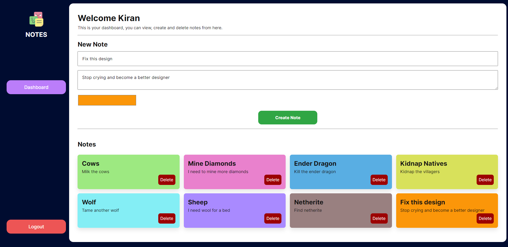

# __Notes__
## A simple application where you can create/edit/delete your own notes.
---

---

### __TODO__
- [❌] Allow note updating
- [❌] Note categorization into notes

## __Features__
- ## Backend
    - REST API
    - JWT Authentication
    - Protected Routes

- ## Frontend
    - Dashboard
    - Signup
    - Login
    - Signout
    - Create Notes
    - Edit Notes
    - Delete Notes    

## __Tools / Stack__
### What I used to build this

- ## Front End
    - ReactJS
    - Redux
    - Thunk
    - React Toastify
    - Framer Motion
    - Styled Components
    - Axios
    - JWT Decode

- ## Back End
    - NodeJS
    - ExpressJS
    - MySQL
    - PrismaJS
    - Compression
    - Helmet
    - Morgan
    - Json Web Tokens
    - BcryptJS 

---
Client Dashboard based on 

https://dribbble.com/shots/15597994-Trembo-Dashboard-Exploration

<a href="https://www.flaticon.com/free-icons/notes" title="notes icons">Notes icons created by Freepik - Flaticon</a>